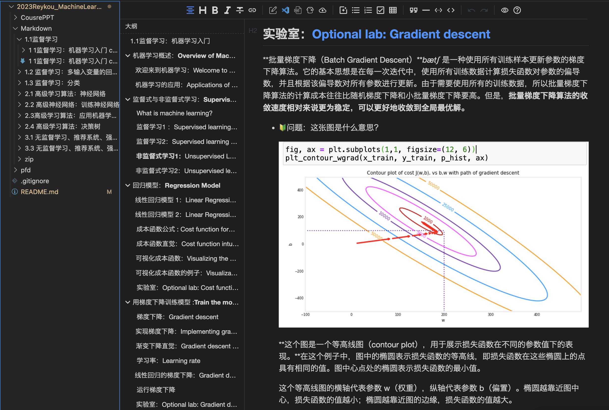
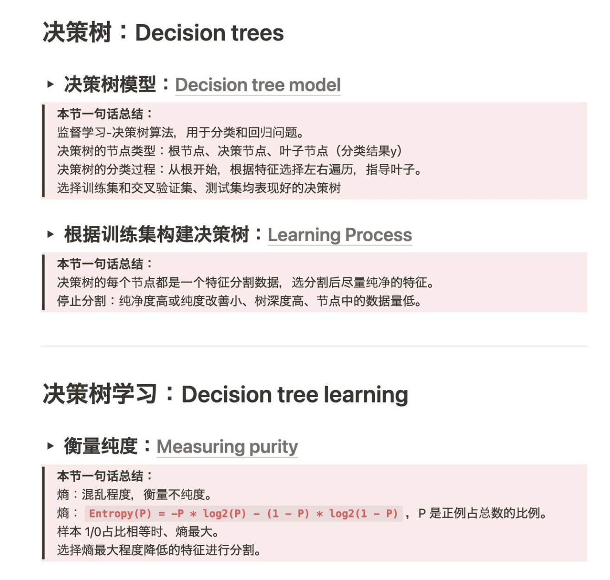

# 2023-MachineLearningNotes 学习笔记

[吴恩达 机器学习专项课程 官方网址](https://www.coursera.org/specializations/machine-learning-introduction)

笔记用尽量简练语言记录每节课的关键信息，上课过程中遇到的问题，会记录解答。

笔记整理过程和疑问的回答，由 ChatGPT4 辅助完成。嘿嘿，应该是全网第一份吧~

记录作业中遇到的问题例：

每节课会用一句话总结例：

Up 主已经拿到吴恩达机器学习和深度学习啦~~~  请放心食用~
