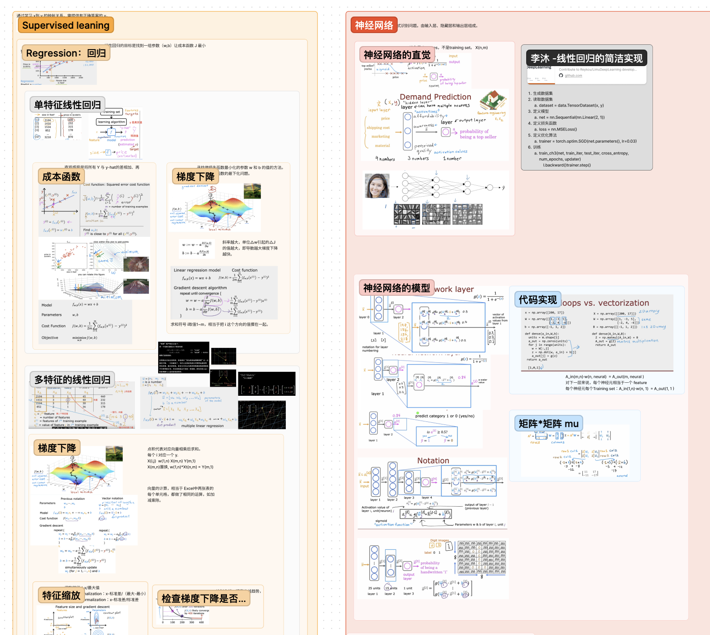

# 2023-MachineLearningNotes 学习笔记

[吴恩达 机器学习专项课程 官方网址](https://www.coursera.org/specializations/machine-learning-introduction)

笔记用尽量简练语言记录每节课的关键信息，上课过程中遇到的问题，会记录解答。

笔记整理过程和疑问的回答，由 ChatGPT4 辅助完成。嘿嘿，应该是全网第一份吧~

记录作业中遇到的问题例：

每节课会用一句话总结例：

Up 主已经拿到吴恩达机器学习和深度学习啦~~~  请放心食用~

[我的 Figma 笔记合集：吴恩达机器学习、吴恩达深度学习、李沐动手学深度学习](https://www.figma.com/file/iLgGgkfnFLBetDUZJK1mAO/%E6%9C%BA%E5%99%A8%E5%AD%A6%E4%B9%A0?type=whiteboard&node-id=0%3A1&t=GZQfsQGy3J9oXjQ2-1)

关于 Figam 笔记合计：吴恩达机器学习很简略，只记录了重点内容。吴恩达深度学习是非常全面的。李沐动手学深度学习正在增加中...

